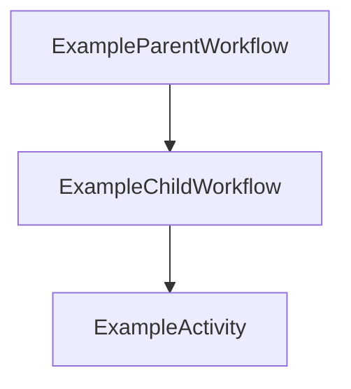

Temporal Example and Introduction
=================================

Temporal is a framework for creating and managing workflows. Workflows are
essentially sequences of tasks.

This repo contains a brief overview of Temporal and an example of the use of
Temporal workflows that incorporates elements from the following Temporal sample code repos:

* "child-workflow" example from https://github.com/temporalio/samples-go
  (child workflows)
* "query" example from https://github.com/temporalio/samples-go (queries)
* https://github.com/temporalio/money-transfer-project-template-go (local
  activities)

To skip the introduction to Temporal and run the example code just skip to the
end of this README file.


Temporal's Place in the "Stack"
-------------------------------

Conventional web apps have, for awhile, commonly used an architecture with
these basic components:

* HTTP application server
* Storage (database and search indexes)
* Long/scheduled operation handling (workers and scheduled scripts)

In the early days of web applications long operations initiated by end users
were often handled by the HTTP application servers themselves but a problem
with this approach was that long-running operations would "block", i.e. delay,
web page responses, keeping users waiting. Some long operations weren't
"on-demand" but instead needed to be scheduled and, given HTTP application
servers don't commonly handle scheduling, operating system features like "cron
jobs" needed to used.

Temporal's role in a web application fits conceptually in the "long operation
handling" category given that it provides a way to manage both user-initiated
and scheduled long operations. Aside from simply handling this role it does so
in a scalable way given that multiple Temporal servers can be run as a cluster
and Temporal will handle orchestration.

Comment from a Stack Overflow reply: "Treat workflows and activities as
long-running operations. Then treat the unit of deployment as a microservice."


Temporal Concepts
-----------------

Temporal incorporates a fair number of concepts, but these are some of the main
ones:

* Cluster: a group of Temporal services and datastores on one or more servers
* Worker: an intermediary between a Temporaral client and a Temporal Cluster,
  implemented as a Worker Program using an SDK's API
* Workflow: logic that coordinates a sequence of tasks
* Activity: a task performed at the request of a client or Workflow
* Query: a request for information from a client to a Workflow


Running a Temporal Instance
---------------------------

If Docker and Docker Compose are installed it's simple to get an instance of Temporal up and running.

    $ git clone https://github.com/temporalio/docker-compose.git
    $ cd docker-compose
    $ docker-compose up

Once an instance is running you'll be able to access its web UI at: http://<host IP address>:8088


Temporal Resources
------------------

Temporal seems, as a project, seems refined. Temporal's Github repositories seem well
organized, example code is clear and concise, and documentation's decent.

Temporal's online documentation exists at: https://docs.temporal.io/

Temporal's Go SDK is documented in detail at: https://pkg.go.dev/go.temporal.io/sdk

Concise samples of code using the Go SDK exist at: git@github.com:temporalio/samples-go.git


Workers
-------

In addition to having a Temporal instance running a worker needs to be running
as well.

Workers are written by application developers using an SDK API. In a worker you
need to create a client instance then, using that, create a worker instance.

Once that's done you need to register the workflows and activities that the
worker will manage.

It doesn't take much code to start up a worker. Here's an example from this
repo:

    package main
    
    import (
        "log"
    
        "go.temporal.io/sdk/client"
        "go.temporal.io/sdk/worker"

        temporal_example "github.com/mcantelon/temporal-example"
    )
    
    func main() {
        // The client is a heavyweight object that should be created only once per process.
        c, err := client.Dial(client.Options{
            HostPort: client.DefaultHostPort,
        })
        if err != nil {
            log.Fatalln("Unable to create client", err)
        }
        defer c.Close()
    
        w := worker.New(c, "example-task-queue", worker.Options{})
    
        w.RegisterWorkflow(temporal_example.ExampleParentWorkflow)
        w.RegisterWorkflow(temporal_example.ExampleChildWorkflow)
        w.RegisterActivity(temporal_example.ExampleActivity)
    
        err = w.Run(worker.InterruptCh())
        if err != nil {
            log.Fatalln("Unable to start worker", err)
        }
    }

Once your worker's up and running you can write scripts and applications that
start the workflows and activities registered with the worker.


Starting Workflows and Activities
---------------------------------

Once a worker's up and running scripts can start workflows and activities.

Here's an example of code to start a workflow:

    workflowID := "parent-workflow_" + uuid.New()
    workflowOptions := client.StartWorkflowOptions{
        ID:        workflowID,
        TaskQueue: "example-task-queue",
    }

    workflowRun, err := c.ExecuteWorkflow(context.Background(), workflowOptions, temporal_example.ExampleParentWorkflow)
    if err != nil {
        log.Fatalln("Unable to execute workflow", err)
    }

Here's a link to a full example in this repo: 

https://github.com/mcantelon/temporal-example/blob/main/starter/main.go

Here's an example of code to start an activity from within a workflow:

    // RetryPolicy specifies how to automatically handle retries if an Activity fails.
    retrypolicy := &temporal.RetryPolicy{
        InitialInterval:    time.Second,
        BackoffCoefficient: 2.0,
        MaximumInterval:    time.Minute,
        MaximumAttempts:    3,
    }
    
    options := workflow.ActivityOptions{
        // Timeout options specify when to automatically timeout Activity functions.
        StartToCloseTimeout: time.Minute,
        // Optionally provide a customized RetryPolicy.
        // Temporal retries failures by default, this is just an example.
        RetryPolicy: retrypolicy,
    }
    
    ctx = workflow.WithActivityOptions(ctx, options)
    err := workflow.ExecuteActivity(ctx, ExampleActivity, "some data").Get(ctx, nil)
    if err != nil {
        return "", err
    }

Here's a link to a full example in this repo:

https://github.com/mcantelon/temporal-example/blob/main/child_workflow.go


Workflow Capabilities
---------------------

Workflows can start child workflows.

Example:

    cwo := workflow.ChildWorkflowOptions{
        WorkflowID: "EXAMPLE-CHILD-WORKFLOW-ID",
    }
    ctx = workflow.WithChildOptions(ctx, cwo)

    var result string
    err = workflow.ExecuteChildWorkflow(ctx, ExampleChildWorkflow, "Some parameters").Get(ctx, &result)
    if err != nil {
        logger.Error("Parent execution received child execution failure.", "Error", err)
        return "", err
    }

Workflows can also be run as "Temporal Cron Jobs", in a scheduled fashion.

Example:

    workflowOptions := client.StartWorkflowOptions{
        CronSchedule: "15 8 * * *",
        // ...
    }
    workflowRun, err := c.ExecuteWorkflow(context.Background(), workflowOptions, YourWorkflowDefinition)
    if err != nil {
        // ...
    }


Workflow Queries
----------------

Queries allow you to request information from running workflows, either via the
SDK API or via the command line tool (tctl).

Example via SDK:

    queryType := "current_state"
    resp, err := c.QueryWorkflow(context.Background(), workflowID, "", queryType)
    if err != nil {
        log.Fatalln("Unable to query workflow", err)
    }
    
    var query_result interface{}
    if err := resp.Get(&query_result); err != nil {
        log.Fatalln("Unable to decode query result", err)
    }
    
    log.Println("Received query result:", query_result)

Example via CLI:

    $ tctl workflow query --workflow_id "some-workflow" --query_type "current_state"


Workflow Event History
----------------------

When workflows run they generate an event history. If workflows run for a long
time and generate a lot of events, however, they can be terminated by the
Temporal Cluster.

Once a workflow generates 10,000 events the Temporal Cluster issues a warning.
Once a workflow generates 50,000 events - or the size limit of 50 MB - the
workflow is terminated.

https://docs.temporal.io/concepts/what-is-an-event-history

There doesn't seem to be an obvious way to get details about the size of a
workflow's event history from within the workflow itself, unfortunately.

There's a mechanism called "continue as new" that allows you to "reboot" a
workflow to purge its event history occasionally but I wasn't able to get it
to work.

https://docs.temporal.io/concepts/what-is-continue-as-new/


Running the Example Code in this Repo
-------------------------------------

From the root of the project, start a Worker:

```bash
go run cmd/worker/main.go
```

Next, start the Workflow Execution:

```bash
go run cmd/starter/main.go
```

Here's the execution sequence of the example workflow:


